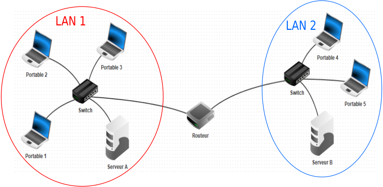
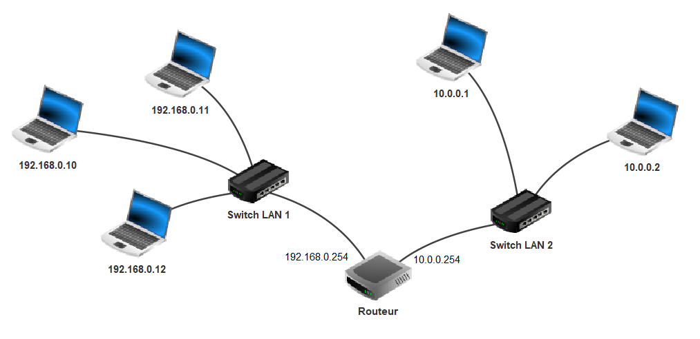

Architecture et protocoles réseau
=================================

Interface réseau
----------------

Une **interface réseau** est le moyen pour une machine, un ordinateur, une tablette ou une imprimante, d’envoyer et
recevoir des données vers un autre appareil lui aussi équipé d’une interface réseau. Cette interface peut être reliée
physiquement par un câble électrique ou une fibre optique ou alors reliée par les ondes comme le wifi, 3G, 4G ou 5G.

Une **interface réseau** possède une adresse matérielle ou adresse MAC (Material Access Control) qui est unique choisie par le constructeur.

Elle se code sur 6 octets notés en hexadécimal, par exemple ``01:23:45:67:89:ab``.

Réseau local (LAN)
------------------

Un réseau local est un ensemble d’appareils reliés entre eux et pouvant s’envoyer et recevoir des données. Au delà de 2 machines, un **switch** est nécessaire pour relier les machines du réseau.

.. figure:: ../img/lan_1.png
   :alt: lan_1.png
   :align: center
   
   Réseau local (LAN)

Internet
---------

Le mot **Internet** est un mot valise qui signifie **Interconnexion de réseaux** (**inter**\ connected **net**\ work). Les différents réseaux sont reliés entre eux par des **routeurs**. Leur rôle est de
transférer les données d'un réseau à un autre jusqu'à son destinataire final en suivant un protocole de communication.

   2 réseaux locaux reliés par un routeur

.. rubric:: Protocole internet

Deux machines qui se trouvent dans des réseaux différents peuvent communiquer grace au **protocole internet**:

#. Les différentes machines d'un réseau ont une **adresse IP** qui leur permet d’être identifiée sur leur réseau local. Cette adresse IP est unique dans son réseau.

   Il existe deux types d’adresses IP:

   -  l’adresse IPv4 codée sur 4 octets soit 32 bits noté en décimal séparés par des **.**
   -  l’adresse IPv6 codée sur 16 octets soit 128 bits noté en hexadécimal séparés par **:**

#. Chaque machine du réseau connait l'adresse IP du **routeur** appelé **passerelle**. Cette passerelle permet à chaque machine de pouvoir communiquer avec des machines se trouvant dans un autre réseau.

   Adressage IP dans 2 réseaux et leurs passerelles

.. rubric:: Adresse et masque de réseau

Un **réseau** est caractérisé par 2 adresses IP : l’\ **adresse réseau** et le **masque réseau**.

Le masque réseau détermine le nombre de machines qui pourront se connecter au réseau. Il définit la plage
d'adresses à utiliser dans le réseau, c'est à dire de la plus petite à la plus grande adresse IP à donner aux machines.

Le masque réseau en IPv4 est une adresse de 32 bits constituée d’une suite de bits tous égaux à 1 suivis de bits tous égaux à 0. Il se note soit sur 4 octets:

- soit sous forme décimale avec des nombres compris entre 0 et 255;
- soit au format CIDR, c’est à dire un nombre placé après l'adresse réseau et qui donne la quantitié de bits égaux à 1.

.. note::
   
   Le nombre :math:`n` de bits égaux à 0 permet de calculer le nombre d'adresses IP disponibles sur le réseau egal à :math:`2^{n}`.

.. admonition:: Exemple

   Soit un réseau d’adresse ``192.168.0.0`` de masque réseau ``255.255.255.0``.

   En binaire, le masque réseau est : ``11111111 11111111 11111111 00000000`` ce qui signifie qu’il y a 24 bits égaux à 1.

   On peut donc noter l’adresse réseau et son masque par l'adresse ``192.168.0.0/24``.

   Ce masque permet d’avoir sur le réseau :math:`2^{8}=256` adresses IP distinctes.

Lorsqu’on connaît l’adresse IP d’une machine dans un réseau local et le masque réseau, il est possible d’obtenir l’adresse réseau en appliquant un **ET** binaire bit à bit sur les deux adresses.

.. admonition:: Exemple

   Une machine dans un réseau local a pour adresse IP 192.168.15.24/28

   L’adresse :math:`192.168.15.24` se note ``11000000.10101000.00001111.00011000`` en binaire et le masque réseau se note ``1111 1111.1111 1111.1111 1111.1111 0000`` (28 bits égaux à 1 suivis de 4 bits égaux à 0).

   On applique un ET binaire entre ces 2 adresses pour obtenir l'adresse réseau auquel appartient la machine.

   .. figure:: ../img/et_binaire.svg
      :alt: et binaire
      :align: center
      :class: center

   .. Retrouver l'adresse réseau à partir d'une adresse IP et du masque réseau

Le modèle internet
------------------

Le **modèle internet** définit la transmission de données entre 2 machines de 2 réseaux distincts. Ce modèle se décompose en 4 couches et 4 protocoles différents.

A chaque changement de couche, les données à transmettre sont encapsulées dans différents paquets qui contiennent :

- les données à transmettre de la **couche application**;
- les numéros de port de la **couche transport**
- les adresses IP de la machine source et de la machine destinataire de la **couche internet**
- les adresses MAC des interfaces réseau de chaque machine de la **couche liaison**

.. rubric:: Couche application

La couche application est la couche à l'origine des données à envoyer. Lorsqu'un utilisateur souhaite transmettre des données, il utilise un logiciel ou une application dédiée. Le protocole utilisé dépend de l'application.

.. rubric:: Couche transport

La couche transport assure que les données envoyées arrivent bien au destinataire sans perte et sans erreur.
Les données sont découpées et envoyées en plusieurs **paquets**.

Il existe différents protocoles de transport. Ce protocole transport utilise des **ports** qui sont 2 nombres entiers associés à l'application utilisée par la couche application. Un échange permanent se fait entre la source et le destinataire pour s'assurer que:

- une communication est établie entre la source et le destinataire;
- les paquets envoyés ne contiennent pas d'erreurs;
- les paquets envoyés ne sont pas perdus. Si cela se produit, les paquets perdus sont renvoyés à nouveau;
- les paquets envoyés sont rassemblés pour reconstituer les données initiales;
- la fin de communication est acceptée par la source et le destinataire.

.. rubric:: Couche internet

La couche internet assure la liaison entre toutes les machines utilisées pour le transport des données. Il y a la
machine à la source de l'envoi et la machine destinataire. La couche internet a aussi connaissance des adresses IP
des différents routeurs utilisés pour la transmission des données.

Le protocole internet assure :

- la liaison entre l'adresse physique de l'interface réseau et l'adresse logique IP (v4 ou v6).
- la liaison entre l'adresse IP d'une machine et le routeur pour accéder à un autre réseau;
- la liaison entre tous les routeurs utilisés pour atteindre un autre réseau.

Les paquets sont encapsulés par les adresses IP des différentes machines utilisées (source, routeurs et destinataire)

.. rubric:: Couche liaison

La couche liaison est la parie physique de la transmission. Les données à envoyer sont tranformées en signaux électriques, lumineux ou en ondes suivant l'interface réseau utilisée. Le protocole utilisé ajoute alors aux données les adresses physiques (MAC) des interfaces réseaux des machines source et destinataire.

.. admonition:: Encapsulation des données

   Les données à envoyer sont complétées par des informations à chaque fois qu'elles traversent une couche. On parle
   d'encapsulation des données. Lorsque les données arrivent au destinataire, elles sont désencapsulées et transmises aux différentes couches (dans l'ordre inverse) jusqu'à l'application.

   On représente les 4 couches de la transmission des données par le diagramme suivant:

   .. figure:: ../img/encapsulation.svg
      :align: center
      :width: 360

